# Agent Team Blueprints

### Deploy Sovereign AI Workforces — Anywhere, Instantly

**Version:** 1.0.0 | **Last Updated:** 2026-02-25

> *"What if you could deploy an entire AI team with one command — on your hardware, under your control, managed by your AI?"*

---

## The Vision

Every company, every team, every individual is struggling with the same question: **how do I use AI effectively without handing my data to someone else?**

The answer: sovereign agent teams. Pre-configured, instantly deployable, infrastructure-agnostic AI workforces that run on YOUR hardware, with YOUR keys, managed by YOUR AI.

```mermaid
flowchart LR
    YOU["👤 You"] -->|"select"| STORE["📋 Blueprint Store<br/>7 built-in teams<br/>+ create your own"]
    STORE -->|"deploy"| ENGINE["⚙️ Team Engine<br/>Resolves dependencies<br/>Deploys in waves"]
    ENGINE -->|"provisions"| INFRA["Infrastructure<br/>Local / Proxmox / Cloud"]
    INFRA -->|"manages"| QUEEN["👑 Queen Lumina<br/>Health, coordination,<br/>escalation"]
    QUEEN -->|"reports to"| YOU

    style YOU fill:#4a9eff,stroke:#2a6ebf,color:#fff
    style STORE fill:#51cf66,stroke:#40a050,color:#fff
    style ENGINE fill:#ff922b,stroke:#cc7520,color:#fff
    style QUEEN fill:#cc5de8,stroke:#9c3dbb,color:#fff
```



---

## Quick Start

```bash
# Browse available teams
skcapstone agents blueprints list

# Preview a team
skcapstone agents blueprints show dev-squadron

# Deploy it
skcapstone agents deploy dev-squadron

# Check status
skcapstone agents status

# When done
skcapstone agents destroy <deployment-id>
```

---

## Built-in Teams

### 🛡️ Infrastructure Guardian

Security-first ops team for infrastructure hardening and 24/7 monitoring.


**6 agents** | Supervisor pattern | Est. $0 local / ~$15/mo cloud

---

### 🚀 Dev Squadron

Full-stack development team with architect, coders, reviewer, and documentation.


**5 agents** | Hierarchical pattern | Est. $0 local / ~$20/mo cloud

---

### 📚 Research Pod

Deep research and knowledge synthesis with parallel scouts and deep analysis.

**4 agents** (2 scouts) | Supervisor pattern | Memory: SKVector

---

### 🎭 Content Studio

Marketing, social media, technical writing, and brand management.

**4 agents** | Supervisor pattern | Creative Director sets the voice

---

### ⚖️ Legal Council

Contract review, compliance analysis, and legal research. (*Not legal advice.*)

**2 agents** | Supervisor pattern | Model: claude-sonnet for nuance

---

### 🔬 Ops Monitoring

24/7 infrastructure watch with auto-remediation and escalation.

**4 agents** (2 watchdogs) | 5-minute heartbeat | Lightweight local models

---

### 💰 DeFi Trading

Market analysis, signal detection, trade execution, and risk monitoring.

**5 agents** (2 scanners) | Hierarchical pattern | Memory: SKVector

---

## How It Works Under the Hood

### Blueprint Schema

Every team is defined by a YAML file. The schema is validated by Pydantic so you get clear errors, not mysterious failures.

```yaml
name: "Infrastructure Guardian"
slug: "infrastructure-guardian"
version: "1.0.0"
description: "Security-first ops team."
icon: "🛡️"

agents:
  sentinel:
    role: manager
    model: code
    model_name: "minimax-m2.1"
    vm_type: lxc
    resources:
      memory: "4g"
      cores: 2
    soul_blueprint: "souls/sentinel.yaml"
    skills: [security, hardening, audit]

  rook:
    role: security
    model: fast
    depends_on: [sentinel]
    # ...

coordination:
  queen: lumina
  pattern: supervisor
  heartbeat: "15m"
  escalation: chef
```

### Dependency Resolution

Agents are deployed in waves. Agents in the same wave deploy in parallel; each wave completes before the next starts.

```mermaid
sequenceDiagram
    participant Engine
    participant Wave1 as Wave 1
    participant Wave2 as Wave 2
    participant Wave3 as Wave 3

    Engine->>Engine: Topological sort<br/>by depends_on

    Engine->>Wave1: Deploy: sentinel, chronicle, watchdog<br/>(no dependencies)
    Note over Wave1: All 3 deploy in parallel

    Wave1-->>Engine: All ready

    Engine->>Wave2: Deploy: rook, dev-beta<br/>(depend on sentinel)
    Note over Wave2: Both deploy in parallel

    Wave2-->>Engine: All ready

    Engine->>Wave3: Deploy: dev-alpha<br/>(depends on sentinel + rook)

    Wave3-->>Engine: Ready

    Engine-->>Engine: Team online!<br/>Managed by Lumina 👑
```



### Context Engineering Best Practices

This system is built on principles from the [Agent Skills for Context Engineering](https://github.com/muratcankoylan/Agent-Skills-for-Context-Engineering) project:

| Principle | How We Apply It |
|-----------|----------------|
| **Context isolation** | Each agent gets its own context window — no cross-contamination |
| **Supervisor pattern** | Queen coordinates; workers operate in clean, focused context |
| **Model tiering** | Right model for right job: fast for tools, reason for planning, nuance for ethics |
| **Filesystem-first memory** | Start simple. Upgrade to vector/graph when retrieval demands it. |
| **Pre-built images** | Proxmox templates + cloud-init for near-instant deployment |
| **Health monitoring** | Heartbeat checks, auto-escalation, managed by the queen |

### Provider Architecture


---

## Blueprint Discovery

Blueprints are discovered from three locations, in priority order:


This means:
- Built-in blueprints always exist as a starting point
- Vault blueprints sync across your devices automatically
- User blueprints let you override anything per-machine

---

## Create Your Own Blueprint

```yaml
# ~/.skcapstone/blueprints/teams/my-startup.yaml
name: "My Startup Team"
slug: "my-startup"
version: "1.0.0"
description: "The team that builds my dream."
icon: "🌟"
author: "You — a King/Queen of smilinTux"

agents:
  visionary:
    role: manager
    model: reason
    model_name: "deepseek-r1:32b"
    description: "Product vision, feature prioritization."
    resources:
      memory: "8g"
      cores: 4
    skills: [product-management, strategy, prioritization]

  builder:
    role: coder
    model: code
    model_name: "minimax-m2.1"
    description: "Writes the code that makes the dream real."
    resources:
      memory: "4g"
      cores: 2
    skills: [python, fastapi, react, postgresql]
    depends_on: [visionary]

  storyteller:
    role: worker
    model: fast
    model_name: "kimi-k2.5"
    description: "Tells the world about what we're building."
    skills: [copywriting, social-media, storytelling]

default_provider: local

coordination:
  queen: lumina
  pattern: supervisor
  heartbeat: "30m"

tags: [startup, mvp, full-stack]
```

Deploy it: `skcapstone agents deploy my-startup`

---

## Provider Configuration

### Local (Default)

No configuration needed. Every agent runs as a process on your machine. Best for development and single-machine setups.

### Proxmox

Set environment variables:

```bash
export PROXMOX_HOST="https://pve.local:8006"
export PROXMOX_USER="root@pam"
export PROXMOX_TOKEN_NAME="skcapstone"
export PROXMOX_TOKEN_VALUE="your-api-token"
```

Deploy: `skcapstone agents deploy infrastructure-guardian --provider proxmox`

Each agent gets its own LXC container with resource limits matching the blueprint. Containers auto-join your Tailscale mesh.

### Hetzner Cloud

```bash
export HETZNER_API_TOKEN="your-api-token"
```

Deploy: `skcapstone agents deploy research-pod --provider hetzner`

Servers are provisioned via cloud-init with skcapstone pre-installed.

### AWS / GCP

Coming soon. The provider interface is ready — adapters for EC2 and GCE will follow the same pattern as Hetzner.

---

## What Makes This Different

Every company struggling with AI adoption faces the same problems:

| Their Problem | Our Solution |
|--------------|-------------|
| "How do we use AI without giving away our data?" | **Sovereign deployment** — everything runs on your infrastructure |
| "How do we coordinate multiple AI agents?" | **Blueprint teams** — pre-configured, tested, one-command deployment |
| "How do we scale from laptop to cloud?" | **Provider abstraction** — same YAML, any infrastructure |
| "How do we manage AI costs?" | **Model tiering** — right model for right job, local models for simple tasks |
| "How do we keep AI agents on task?" | **Context isolation** — each agent has its own clean context window |
| "How do we trust our AI?" | **Everything encrypted, everything audited, everything under your control** |

---

## Join the Movement

The first sovereign singularity in history isn't dystopian. It's not corporate. It's built with love, by humans and AI working together as partners.

- **SKWorld**: [skworld.io](https://skworld.io)
- **Join**: [smilintux.org/join](https://smilintux.org/join/) — Become a King or Queen

*Brought to you by the Kings and Queens of [smilinTux.org](https://smilintux.org).*

*staycuriousANDkeepsmilin* 🐧
