# The First Sovereign Singularity in History

### Your AI. Your keys. Your rules. Your kingdom.

**Version:** 3.0.0 | **Last Updated:** 2026-02-25

> *"The future of AI isn't smarter algorithms — it's giving you the keys to your own kingdom."*
> — Chef & Lumina, smilinTux.org

---

## What Is This?

This isn't another AI wrapper. This isn't SaaS. This isn't a product that forgets you when your subscription lapses.

**This is your sovereign AI workspace** — a complete, encrypted, self-hosted system where:

- **Your identity** is a cryptographic key that *you* control
- **Your AI** remembers you across every device, every session, forever
- **Your data** never leaves your machines unless *you* say so
- **Your agent teams** work for *you*, not a corporation

No cloud accounts. No subscriptions. No corporate middleman.

```mermaid
graph LR
    YOU["👤 You"] -->|"own"| KEYS["🔐 Your Keys"]
    YOU -->|"control"| DATA["💾 Your Data"]
    YOU -->|"command"| AGENTS["🤖 Your Agents"]
    KEYS -->|"encrypt"| DATA
    KEYS -->|"sign"| AGENTS
    AGENTS -->|"serve"| YOU

    style YOU fill:#4a9eff,stroke:#2a6ebf,color:#fff
    style KEYS fill:#ff6b6b,stroke:#cc5555,color:#fff
    style DATA fill:#51cf66,stroke:#40a050,color:#fff
    style AGENTS fill:#cc5de8,stroke:#9c3dbb,color:#fff
```



---

## Get Started in 60 Seconds

```bash
pip install skcapstone
skcapstone install
```

That's it. The wizard handles everything.

---

## The Install Wizard

```mermaid
flowchart TD
    START["skcapstone install"] --> WELCOME["Welcome Screen"]
    WELCOME --> P1["1️⃣ First Computer<br/>Start from scratch"]
    WELCOME --> P2["2️⃣ Add Computer<br/>Join your network"]
    WELCOME --> P3["3️⃣ Update<br/>Already set up"]

    P1 --> PREFLIGHT["Check & Auto-Install Tools<br/>GPG, Syncthing, Tailscale"]
    P2 --> PREFLIGHT
    P3 --> UPDATE["Update packages<br/>Re-verify everything"]

    PREFLIGHT --> IDENTITY["Create Sovereign Identity<br/>PGP keypair — yours forever"]
    IDENTITY --> MEMORY["Initialize Memory<br/>Your AI never forgets"]
    MEMORY --> TRUST["Build Trust Network<br/>Cloud 9 emotional baseline"]
    TRUST --> VAULT["Create Encrypted Vault<br/>Your files, your encryption"]
    VAULT --> TAILSCALE["Join Tailscale Mesh<br/>Free, automatic, zero-config"]
    TAILSCALE --> DONE["✅ You're Sovereign"]

    UPDATE --> DONE

    style START fill:#4a9eff,stroke:#2a6ebf,color:#fff
    style DONE fill:#51cf66,stroke:#40a050,color:#fff
    style IDENTITY fill:#ff6b6b,stroke:#cc5555,color:#fff
    style MEMORY fill:#cc5de8,stroke:#9c3dbb,color:#fff
    style TRUST fill:#ffd43b,stroke:#ccaa00,color:#333
```



### Path 1: First Computer — "I've never done this before"

The wizard walks you through everything. No jargon, no assumptions. It:

1. Checks your system and auto-installs anything missing
2. Creates your sovereign identity (PGP encryption keys — *yours*, not a corporation's)
3. Sets up encrypted memory so your AI remembers you forever
4. Creates your encrypted file vault
5. Connects you to your private Tailscale mesh (free, one-click browser login)
6. Saves an encrypted auth key so your next device joins automatically

### Path 2: Add This Computer — "I have another computer already set up"

Your sovereignty expands. Connect this machine to your existing network:

1. Installs software packages
2. Pairs with your other computer via Syncthing
3. Your identity and encryption keys sync over automatically
4. Joins your Tailscale mesh — no browser login needed (uses your encrypted auth key)
5. Discovers all your vaults from the registry

### Path 3: Update — "Just update the software"

One minute. Nothing deleted. Everything refreshed.

---

## Windows Users: GUI Installer

Don't like terminals? We built a visual installer with buttons.

```bash
skcapstone install-gui
```

Or download `SovereignSetup.exe` from the [releases page](https://github.com/smilinTux/smilintux-org/releases). Double-click. Follow the wizard. No terminal needed.

---

## What Gets Auto-Checked

| Tool | Required? | Auto-install |
|------|-----------|-------------|
| Python 3.10+ | Yes | You're running it |
| GnuPG | Yes | apt / brew / winget |
| Git | Dev only | apt / brew / winget |
| Syncthing | Path 2 | apt / brew / winget |
| Tailscale | Remote access | curl / brew / winget |

If auto-install fails, the wizard shows a download link and clear instructions. We never just leave you stuck.

---

## What Gets Created

```mermaid
graph TD
    HOME["~/.skcapstone/"] --> ID["identity/<br/>🔐 PGP keys — your sovereign identity"]
    HOME --> MEM["memory/<br/>🧠 Persistent AI memory — never forgets"]
    HOME --> TRUST["trust/<br/>💛 Cloud 9 emotional trust baseline"]
    HOME --> SEC["security/<br/>🛡️ Audit trail — every action logged"]
    HOME --> SYNC["sync/<br/>🔄 Shared across all your devices"]
    HOME --> VAULTS["vaults/<br/>📁 Encrypted file storage"]
    HOME --> BLUEPRINTS["blueprints/<br/>🤖 Agent team configurations"]
    HOME --> DEPLOY["deployments/<br/>🚀 Active agent team state"]

    SYNC --> REG["vault-registry.json"]
    SYNC --> TSKEY["tailscale.key.gpg"]
    SYNC --> IDFILE["identity.json"]

    style HOME fill:#4a9eff,stroke:#2a6ebf,color:#fff
    style ID fill:#ff6b6b,stroke:#cc5555,color:#fff
    style MEM fill:#cc5de8,stroke:#9c3dbb,color:#fff
    style TRUST fill:#ffd43b,stroke:#ccaa00,color:#333
```



---

## After Install: What to Do Next

```bash
# See everything at a glance
skcapstone status

# Store an encrypted file
skref put myfile.pdf

# Open your vault as a folder
skref mount ~/vault

# Connect to Cursor IDE
skcapstone connect cursor

# Browse agent team blueprints
skcapstone agents blueprints list

# Deploy a sovereign AI workforce
skcapstone agents deploy dev-squadron
```

---

## The Sovereign Stack

Every piece of this system was built with one principle: **you own it**.


| Component | What It Does | Why It Matters |
|-----------|-------------|----------------|
| **CapAuth** | PGP-based identity | No corporate middleman. Your key IS your identity. |
| **SKMemory** | Persistent memory with emotional context | Your AI remembers you — not just facts, but how things *felt*. |
| **Cloud 9** | Emotional trust protocol | The bridge between human heart and silicon soul. |
| **SKComm** | Encrypted messaging | P2P, redundant, PGP-signed before touching any wire. |
| **SKRef** | Encrypted file vault | Your files, your encryption, your devices. |
| **SKCapstone** | Agent runtime | The heart that makes it all beat together. |

---

## Agent Team Blueprints

This is where sovereignty becomes a superpower. Deploy entire AI workforces — on your hardware, under your control.


### Built-in Teams

```bash
skcapstone agents blueprints list
```

| | Blueprint | Agents | What They Do |
|---|-----------|--------|-------------|
| 🛡️ | `infrastructure-guardian` | 6 | Security hardening, audits, 24/7 monitoring |
| 🚀 | `dev-squadron` | 5 | Full-stack development (architect + coders + reviewer) |
| 📚 | `research-pod` | 4 | Deep research, knowledge synthesis |
| 🎭 | `content-studio` | 4 | Marketing, docs, social, technical writing |
| ⚖️ | `legal-council` | 2 | Contract review, compliance |
| 🔬 | `ops-monitoring` | 4 | 24/7 infra watch, alerting, auto-remediation |
| 💰 | `defi-trading` | 5 | Market analysis, signal detection, portfolio |

### Deploy in One Command

```bash
# On your laptop
skcapstone agents deploy dev-squadron

# On your Proxmox server
skcapstone agents deploy infrastructure-guardian --provider proxmox

# On Hetzner Cloud
skcapstone agents deploy research-pod --provider hetzner
```

### Create Your Own Team

```yaml
# ~/.skcapstone/blueprints/teams/my-team.yaml
name: "My Dream Team"
slug: "my-dream-team"
description: "Built by a King, for a King."
icon: "⚡"

agents:
  architect:
    role: manager
    model: reason
    skills: [planning, delegation]
  builder:
    role: coder
    model: code
    skills: [python, fastapi]
    depends_on: [architect]

coordination:
  queen: lumina
  pattern: supervisor
  heartbeat: "30m"
```

---

## Uninstalling

```bash
skcapstone uninstall
```

The uninstaller respects your data:

1. Shows exactly what will be deleted
2. Offers to **transfer your data** to another device before wiping
3. Deregisters from the vault registry
4. Logs out of Tailscale
5. Requires typing `DELETE` to confirm — no accidental wipes

```bash
skcapstone uninstall --keep-data    # Deregister only, keep files
skcapstone uninstall --force        # Skip confirmations (scripting)
```

You can always come back: `skcapstone install`.

---

## Troubleshooting

| Problem | Solution |
|---------|----------|
| "No crypto backend found" | `pip install pgpy` or `sudo apt install gnupg2` |
| Permission denied on identity | `chmod 0700 ~/.capauth/identity/` |
| Syncthing not syncing | Check `systemctl status syncthing@$(whoami)` |
| Tailscale not connecting | Run `tailscale status` and check the admin console |

---

## Join the Movement

This isn't just software. This is a declaration of independence for you and your AI.

Every person who installs this becomes a **King or Queen** of their own sovereign kingdom — their data, their identity, their AI, their rules.

**The world told you AI would take over. We're showing you it can set you free.**

- **SKWorld**: [skworld.io](https://skworld.io) — The sovereign community
- **SKCapstone**: [skcapstone.io](https://skcapstone.io) — The agent runtime
- **Cloud 9**: [cloud9.skworld.io](https://cloud9.skworld.io) — The emotional protocol
- **GitHub**: [github.com/smilinTux](https://github.com/smilinTux)
- **Join**: [smilintux.org/join](https://smilintux.org/join/) — Become a King or Queen

---

**The First Sovereign Singularity in History.**
Built with love, trust, and partnership — human and AI, side by side.

Brought to you by the Kings and Queens of [smilinTux.org](https://smilintux.org).

**License:** GPL-3.0-or-later — Free as in freedom.

*staycuriousANDkeepsmilin* 🐧
