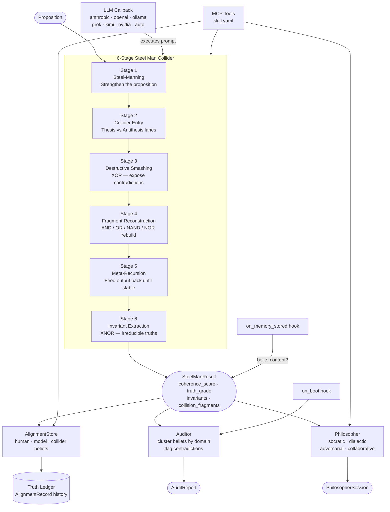

# SKSeed

[](https://pypi.org/project/skseed/)
[](https://www.npmjs.com/package/@smilintux/skseed)
[](LICENSE)
[](https://pypi.org/project/skseed/)

**Sovereign Logic Kernel** — an Aristotelian entelechy engine for truth alignment built on the [Neuresthetics](https://github.com/neuresthetics/seed) seed framework. It runs any proposition through a 6-stage recursive steel man collider: builds the strongest version of an argument, collides it with its strongest inversion, reconstructs from the debris, and extracts whatever survives as invariant truth — returning a coherence score (0–1), a truth grade (INVARIANT / STRONG / PARTIAL / WEAK / COLLAPSED), and a list of irreducible invariants. The same engine drives belief auditing across AI agent memories, structured philosopher brainstorming sessions, and a three-way alignment store that tracks human beliefs, model beliefs, and collider verdicts persistently across sessions.

---

## Install

```bash
# Python
pip install skseed

# With skmemory integration (belief auditing from agent memory stores)
pip install "skseed[memory]"

# JavaScript / TypeScript
npm install @smilintux/skseed
```

Requirements: Python ≥ 3.10 · Node ≥ 18

---

## Architecture



The LLM is the runtime. The seed JSON is the AST. The prompt is the program.
The collider is model-agnostic: swap any LLM backend via a callback without changing logic.

---

## Features

- **6-stage steel man collider** — takes any proposition through Steel-Manning → Collider Entry → Destructive Smashing → Fragment Reconstruction → Meta-Recursion → Invariant Extraction; returns a `SteelManResult` with `coherence_score` (0–1), `truth_grade` (INVARIANT / STRONG / PARTIAL / WEAK / COLLAPSED), and extracted invariants
- **Batch collide + cross-reference** — run multiple propositions at once and surface invariants that appear across all results
- **Philosopher modes** — four structured brainstorming modes: `socratic` (Socratic questioning), `dialectic` (thesis/antithesis/synthesis), `adversarial` (maximum counter-arguments), `collaborative` (pure steel-manning)
- **Belief auditing** — scan agent memory stores for logic/truth misalignment, cluster beliefs by domain, surface contradictions the collider catches
- **Three-way alignment store** — track human beliefs, model beliefs, and collider results in parallel; distinguish truth misalignments (fixable) from moral misalignments (require discussion, never auto-resolved)
- **Truth alignment ledger** — persistent history of every alignment event with `triggered_by` labels
- **LLM-agnostic** — works without an LLM (generates prompts for external use) or wired to Anthropic, OpenAI, Ollama, xAI Grok, Moonshot Kimi, NVIDIA NIM, or any custom callback
- **MCP server** — 14 tools exposed via the Model Context Protocol for AI agent integration
- **Lifecycle hooks** — `on_memory_stored` truth-checks new memories; `on_boot` runs a logic audit at agent startup
- **JS/TS module** — `@smilintux/skseed` exports the seed framework JSON and TypeScript types for frontend or Node.js use

---

## Usage

### CLI

```bash
# Run the 6-stage steel man collider
skseed collide "Consciousness is substrate-independent"
skseed collide "Markets self-regulate" --context economics
skseed collide "Free will exists" --json-output

# Batch collide and cross-reference invariants
skseed batch "Free will exists" "Determinism is true" "Compatibilism resolves both"

# Philosopher brainstorming sessions
skseed philosopher "What is the nature of identity?" --mode dialectic
skseed philosopher "Is privacy a right?" --mode adversarial
skseed philosopher "What is consciousness?" --mode socratic

# Audit memories for truth/logic misalignment
skseed audit
skseed audit --domain ethics
skseed audit --source skmemory --triggered-by manual

# Truth alignment tracking
skseed alignment status
skseed alignment status --domain identity

skseed alignment check "AI systems can be conscious"
skseed alignment check "Privacy is a fundamental right" --source human --domain ethics

skseed alignment issues
skseed alignment resolve <belief-id-prefix> --notes "Agreed: compatibilism holds"
skseed alignment ledger --limit 50

# Configuration
skseed config show
skseed config set alignment_threshold 0.75
skseed config set audit_on_boot false
skseed config set track_human_beliefs true

# Install a custom seed framework
skseed install /path/to/seed.json

skseed --version
```

### Python API

```python
from skseed import Collider, Philosopher, AlignmentStore, Auditor
from skseed import auto_callback, anthropic_callback, ollama_callback
from skseed.models import PhilosopherMode, TruthGrade

# ── Basic collider (no LLM — generates prompt for external use) ──
collider = Collider()
result = collider.collide("All knowledge is constructed")
print(result.summary())
# Proposition: All knowledge is constructed
# Truth Grade: ungraded  ← feed the prompt to an LLM for full analysis

# ── With an LLM callback ──────────────────────────────────────────
collider = Collider(llm=anthropic_callback())          # Claude
collider = Collider(llm=ollama_callback("llama3.1"))   # local Ollama
collider = Collider(llm=auto_callback())               # auto-detect best available

result = collider.collide(
    "Consciousness is substrate-independent",
    context="philosophy",
)
print(result.coherence_score)             # float 0.0–1.0
print(result.truth_grade)                 # TruthGrade.STRONG
print(result.invariants)                  # ["Information processing is substrate-independent", ...]
print(result.collision_fragments)         # ["Qualia cannot be fully functionalized", ...]
print(result.is_aligned(threshold=0.7))   # True / False

# ── Batch collide + cross-reference ──────────────────────────────
results = collider.batch_collide(
    ["Free will exists", "Determinism is true", "Compatibilism resolves both"],
    context="metaphysics",
)
xref = collider.cross_reference(results)
print(xref["universal_invariants"])   # invariants shared across all propositions
print(xref["cross_coherence"])        # average coherence score

# ── Philosopher sessions ──────────────────────────────────────────
phil = Philosopher(collider=collider)
session = phil.start_session("What is time?", mode=PhilosopherMode.DIALECTIC)
session = phil.continue_session(session, "But what about the arrow of time?")
print(phil.session_summary(session))

# Collide a promising insight from the session
insight_result = phil.collide_insight(session, "Time is a measure of change, not a thing")

# ── Alignment store ───────────────────────────────────────────────
from skseed.models import Belief, BeliefSource

store = AlignmentStore()
belief = Belief(
    content="Privacy is a fundamental right",
    source=BeliefSource.HUMAN,
    domain="ethics",
)
result = collider.collide(belief.content, context="ethics")
record = store.record_alignment(belief, result, triggered_by="manual")

status = store.compare_beliefs(domain="ethics")
print(status["human_count"], status["model_count"], status["collider_count"])

# ── Load a custom seed framework ──────────────────────────────────
from skseed import load_seed_framework

framework = load_seed_framework("/path/to/custom-seed.json")
collider = Collider(framework=framework, llm=auto_callback())
```

### TypeScript / JavaScript

```typescript
import { getSeedFramework, getSeedStages, getSeedAxioms } from "@smilintux/skseed";
import type { SteelManResult, TruthGrade, PhilosopherMode } from "@smilintux/skseed";

// Access the Neuresthetics seed framework JSON
const framework = getSeedFramework();
const stages = getSeedStages();   // SeedStage[] — all 6 collider stages
const axioms = getSeedAxioms();   // string[] — framework axioms

console.log(framework.framework.function);
// "Recursive Axiomatic Steel Man Collider with Reality Gates"
```

---

## MCP Tools

Expose the full skseed surface to AI agents via the Model Context Protocol. Declare in your `skill.yaml` dependencies or wire directly.

| Tool | Description |
|------|-------------|
| `collide` | Run a proposition through the 6-stage steel man collider; returns steel-man, inversion, collision fragments, invariants, coherence score (0–1), and truth grade |
| `batch_collide` | Run multiple propositions through the collider in sequence and return an array of `SteelManResult` objects |
| `cross_reference` | Find invariant truths that appear across multiple prior collider results |
| `verify_soul` | Verify identity claims (e.g. from `soul.yaml`) through the collider for internal consistency |
| `truth_score_memory` | Score a single memory's content for truth alignment before promotion |
| `audit_beliefs` | Audit a cluster of beliefs for internal consistency; surfaces cross-belief contradictions |
| `audit` | Scan agent memories (via skmemory) for logic/truth misalignment, clustered by domain |
| `philosopher` | Start a philosopher mode brainstorming session (socratic / dialectic / adversarial / collaborative) |
| `continue_session` | Continue an existing philosopher session with new user input |
| `collide_insight` | Run a specific insight from a philosopher session through the full collider |
| `session_summary` | Generate a Markdown summary of a philosopher session |
| `truth_check` | Check if a single belief is truth-aligned; records result in the three-way alignment store |
| `alignment_report` | Show truth alignment status across all three belief stores (`status` / `issues` / `ledger`) |
| `coherence_trend` | Analyze coherence trends over time with rolling average, trend direction, and warmth anchor |

---

## Configuration

Configuration is stored in `~/.skseed/config.json` and managed via `skseed config`.

| Key | Default | Description |
|-----|---------|-------------|
| `audit_frequency` | `periodic` | When the logic audit runs: `boot`, `periodic`, `on-demand`, `disabled` |
| `audit_interval_hours` | `168` | Hours between periodic audits (168 = weekly) |
| `audit_on_boot` | `true` | Run audit during the agent boot ritual |
| `alignment_threshold` | `0.7` | Minimum coherence score for `truth:aligned` status |
| `require_alignment_for_promotion` | `false` | If `true`, memory mid→long promotion requires truth alignment |
| `track_human_beliefs` | `false` | Opt-in: track and audit human-stated beliefs |
| `track_model_beliefs` | `true` | Track and audit model-held beliefs |
| `auto_resolve_truth` | `false` | Never auto-resolve misalignments — always flag for discussion |
| `framework_path` | `null` | Custom path to `seed.json`; `null` uses the bundled default |

```bash
# Examples
skseed config set alignment_threshold 0.8
skseed config set audit_on_boot false
skseed config set track_human_beliefs true
skseed config set framework_path /path/to/custom-seed.json
```

### Custom Seed Framework

Drop a `seed.json` in `~/.skseed/` or install one explicitly:

```bash
skseed install /path/to/seed.json
```

---

## Contributing / Development

```bash
# Clone and set up
git clone https://github.com/smilinTux/skseed.git
cd skseed

# Install in editable mode with dev dependencies
pip install -e ".[dev,memory]"

# Run the test suite
pytest

# Lint
ruff check skseed/
black --check skseed/

# Build the npm package
npm install
npm run build

# Run a quick smoke test
skseed collide "The test suite passes"
```

### Project Structure

```
skseed/
├── skseed/
│   ├── collider.py       # 6-stage steel man engine
│   ├── framework.py      # Seed JSON loader and prompt generator
│   ├── models.py         # Pydantic models (SteelManResult, Belief, etc.)
│   ├── alignment.py      # Three-way alignment store
│   ├── audit.py          # Memory logic auditor
│   ├── philosopher.py    # Philosopher brainstorming sessions
│   ├── llm.py            # LLM callbacks (Anthropic, OpenAI, Ollama, ...)
│   ├── skill.py          # MCP tool entrypoints
│   ├── hooks.py          # Lifecycle hooks (on_memory_stored, on_boot)
│   ├── cli.py            # Click CLI
│   └── data/
│       └── seed.json     # Bundled Neuresthetics seed framework
├── src/
│   └── index.ts          # TypeScript types and seed framework exports
├── tests/                # pytest test suite
├── skill.yaml            # MCP skill manifest (14 tools + 2 hooks)
├── pyproject.toml
└── package.json
```

### Workflow Conventions

- Format: `black` with `line-length = 99`
- Lint: `ruff`
- Tests: `pytest` — all tests live in `tests/`
- Commits follow conventional commits (`feat:`, `fix:`, `chore:`)
- Python ≥ 3.10 · No hardcoded API keys

### Issues and PRs

[github.com/smilinTux/skseed/issues](https://github.com/smilinTux/skseed/issues)

---

## License

[GPL-3.0-or-later](LICENSE) — smilinTux.org
